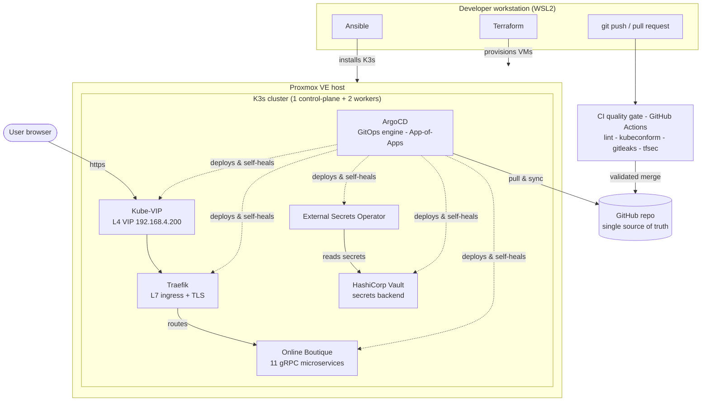

# Homelab Hybrid GitOps Platform

A production-grade, self-healing Kubernetes platform built from bare metal on a single Proxmox VE host, driven end-to-end by Infrastructure-as-Code and GitOps. The entire cluster state — networking, ingress, secrets, and a polyglot microservice application — is declared in this repository, validated by a CI quality gate, and continuously reconciled by ArgoCD.

## Architecture



CI validates, ArgoCD deploys — the pipeline never applies to the cluster directly. This separation keeps Git the single source of truth while a quality gate blocks malformed or insecure changes before they reach `main`.

## Stack

| Layer | Technology |
|-------|------------|
| Infrastructure as Code | Terraform (`bpg/proxmox`), cloud-init |
| Configuration management | Ansible |
| Orchestration | K3s |
| GitOps engine | ArgoCD (App-of-Apps) |
| L4 load balancer | Kube-VIP (ARP) + kube-vip cloud-provider |
| L7 ingress | Traefik v3 (Helm), TLS termination |
| Secrets management | HashiCorp Vault + External Secrets Operator |
| Demo application | Google Online Boutique (Kustomize) |
| CI quality gate | GitHub Actions (yamllint, terraform validate, kubeconform, gitleaks, tfsec) |
| Hypervisor | Proxmox VE |

## How it works

1. **Terraform** clones a cloud-init template on Proxmox into three VMs from a single `for_each` map, authenticated with a least-privilege API token.
2. **Ansible** hardens the OS (kernel modules, sysctl, swap-off) and bootstraps the K3s cluster: control-plane on the master, agents joined via token, kubeconfig pulled to the workstation.
3. **CI (GitHub Actions)** runs on every pull request and push to `main`: YAML/Terraform linting, Kustomize rendering and `kubeconform` schema validation, and `gitleaks`/`tfsec` security scanning. The pipeline validates only — it never deploys.
4. **ArgoCD** is bootstrapped once, then a single root `Application` (App-of-Apps) watches `argocd/apps/` and recursively deploys every other component. From this point, all changes flow through Git — no imperative `kubectl apply`.
5. **Kube-VIP** provides an on-prem LoadBalancer IP pool; **Traefik** claims a virtual IP and terminates TLS, routing L7 traffic by hostname.
6. **Vault + External Secrets Operator** keep all sensitive data out of Git: secrets live in Vault, ESO authenticates via Kubernetes-native TokenReview and materializes them as native `Secret` objects.
7. **Online Boutique** (11 gRPC microservices) runs with resource requests trimmed via a Kustomize JSON6902 patch to maximize density on commodity hardware.

## Repository structure

```
homelab-gitops/
├── .github/workflows/            # CI quality gate (lint, k8s validation, security)
├── terraform/                    # Phase 1 — VMs on Proxmox (reusable module + for_each)
├── ansible/                      # Phase 2 — OS hardening + K3s install
│   ├── inventory/
│   ├── roles/                    # common, k3s_server, k3s_agent, argocd
│   └── playbooks/
├── argocd/                       # Phase 3 — GitOps layer
│   ├── projects/                 # AppProject (RBAC, allowed repos)
│   ├── apps/                     # App-of-Apps children
│   └── root-app.yaml             # root Application
└── kubernetes/
    ├── infrastructure/           # kube-vip, traefik, vault, external-secrets
    └── applications/             # online-boutique
```

## Key engineering decisions

- **DRY infrastructure** — a single reusable Terraform module driven by a map; scaling the cluster is a one-line change.
- **App-of-Apps** — one root application bootstraps the entire platform; adding a component is a single Git commit.
- **CI/CD separation** — GitHub Actions validates (shift-left), ArgoCD deploys; the pipeline never touches the cluster, preserving Git as the single source of truth.
- **Zero-trust secrets** — Vault + ESO with Kubernetes auth; the public repo contains declarations only, never values.
- **Resource discipline** — every workload tuned to coexist within 16 GB RAM across three nodes.
